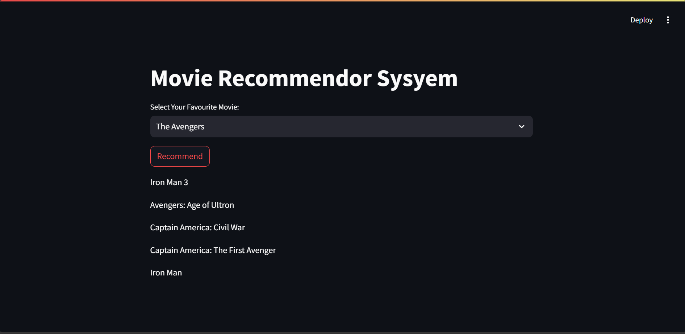

# 🎬 Movie Recommendation System


Welcome to the **Movie Recommendation System** project! This project aims to recommend movies based on a given movie title using Natural Language Processing (NLP) and Cosine Similarity.

## 📋 Table of Contents

- [Introduction](#introduction)
- [Dataset](#dataset)
- [Installation](#installation)
- [Usage](#usage)
- [Technologies Used](#technologies-used)
- [Model Explanation](#model-explanation)
- [Results](#results)
- [Contributing](#contributing)

## 🎥 Introduction

In this project, we build a movie recommendation system using data from the TMDB dataset. By analyzing various features such as genres, keywords, cast, and crew, the system recommends movies similar to the one provided by the user.

## 🎞️ Dataset

We use the TMDB 5000 Movie Dataset which contains information about 5000 movies including genres, keywords, cast, crew, and more.

## ⚙️ Installation

1. Clone the repository:
    ```sh
    git clone https://github.com/rakeshreddyadina/Movie-Recommendation-System.git
    cd Movie-Recommendation-System
    ```

2. Install the required packages:
    ```sh
    pip install pandas numpy streamlit
    ```

3. Download the dataset and place the `tmdb_5000_movies.csv` and `tmdb_5000_credits.csv` files in the project directory.

4. Run the Jupyter notebook to preprocess the data and generate the similarity matrix:
    ```sh
    jupyter notebook movie_recommendation.ipynb
    ```

5. Ensure you have the `similarity.pkl` and `movies_dict.pkl` files generated from the preprocessing step.

## 🚀 Usage

1. Start the Streamlit application:
    ```sh
    streamlit run app.py
    ```

2. Open your browser and go to `http://localhost:8501` to view the Movie Recommendation System.

3. Select your favorite movie from the dropdown menu and click on 'Recommend' to get similar movie suggestions.

## 🛠️ Technologies Used

- **Python**: Programming language used for data processing and model creation.
- **Pandas**: Data manipulation and analysis.
- **NumPy**: Numerical operations.
- **NLTK**: Natural Language Toolkit for text processing.
- **Scikit-learn**: Machine Learning library for implementing the Count Vectorizer and Cosine Similarity.
- **Streamlit**: Web framework for creating the interactive web application.
- **Pickle**: Saving and loading trained models.

## 🧠 Model Explanation

1. **Data Preprocessing**: 
    - Merge movie and credits data on the movie title.
    - Select relevant features: `movie_id`, `title`, `overview`, `genres`, `keywords`, `cast`, and `crew`.
    - Remove missing values and duplicates.

2. **Feature Engineering**:
    - Convert genres, keywords, cast, and crew from JSON strings to lists.
    - Extract the names of the top 3 cast members and the director.
    - Combine overview, genres, keywords, cast, and crew into a single string of tags.
    - Perform stemming on the tags to reduce words to their root form.

3. **Vectorization and Similarity Calculation**:
    - Convert the tags into vectors using Count Vectorizer.
    - Calculate the cosine similarity between the vectors.

4. **Recommendation**:
    - Find the top 5 movies with the highest similarity score to the selected movie.

## 📊 Results



The system provides a list of movies similar to the selected movie, helping users discover new movies based on their preferences.

## 🤝 Contributing

Contributions are welcome! Please fork the repository and submit a pull request with your improvements.
